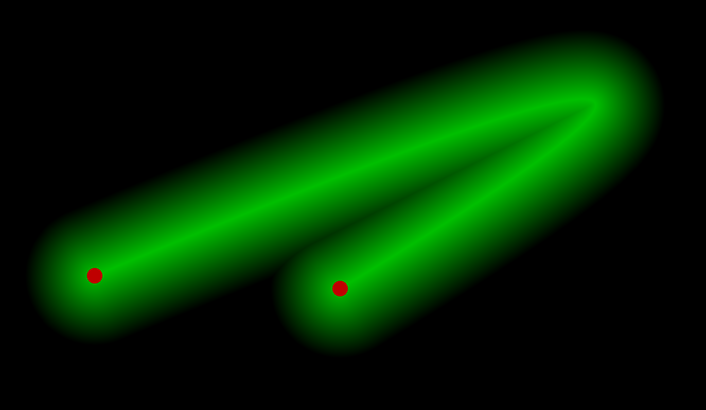

# Bézier Curve

Just a fun little project to learn how to render Bézier Curves.

## CPU implementation


## GPU implementation



## Screencasts

| Thumbnail | Link |
| --- | --- |
| [](https://www.youtube.com/watch?v=2oKzBq43ShE&list=PLpM-Dvs8t0VY5sYK_mm1k9dZw5tFWgg4L) | [Coding Bézier Curves — Day 1](https://www.youtube.com/watch?v=2oKzBq43ShE&list=PLpM-Dvs8t0VY5sYK_mm1k9dZw5tFWgg4L) |
| [](https://www.youtube.com/watch?v=m4gVWZ_OkG4&list=PLpM-Dvs8t0VY5sYK_mm1k9dZw5tFWgg4L) | [Bézier Curves using OpenGL Fragment Shader — Day 2](https://www.youtube.com/watch?v=m4gVWZ_OkG4&list=PLpM-Dvs8t0VY5sYK_mm1k9dZw5tFWgg4L) |

## Quick Start

```console
$ make
$ ./cpu.exe
$ ./gpu.exe
```

## Setup compiller environment in Windows 

Install latest [msys2_64](https://www.msys2.org/)

Run MSYS2 console : `msys2.exe`

In console install packages with pacman: `pacman -Sy git mingw-w64-i686-toolchain mingw32/mingw-w64-i686-SDL2 mingw32/mingw-w64-i686-SDL2_mixer mingw32/mingw-w64-i686-SDL2_image mingw32/mingw-w64-i686-SDL2_ttf mingw32/mingw-w64-i686-SDL2_net mingw32/mingw-w64-i686-cmake mingw32/mingw-w64-i686-libepoxy make`. (it's for 32 bit version installation)

Add to system `PATH` compiller directory name `C:\msys64\mingw32\bin`

Dublicate `mingw32-make.exe` into `make.exe` to get ability to run make with a classic command `make`.

## References

- https://www.geogebra.org/m/WPHQ9rUt
- https://gist.github.com/jordandee/94b187bcc51df9528a2f
